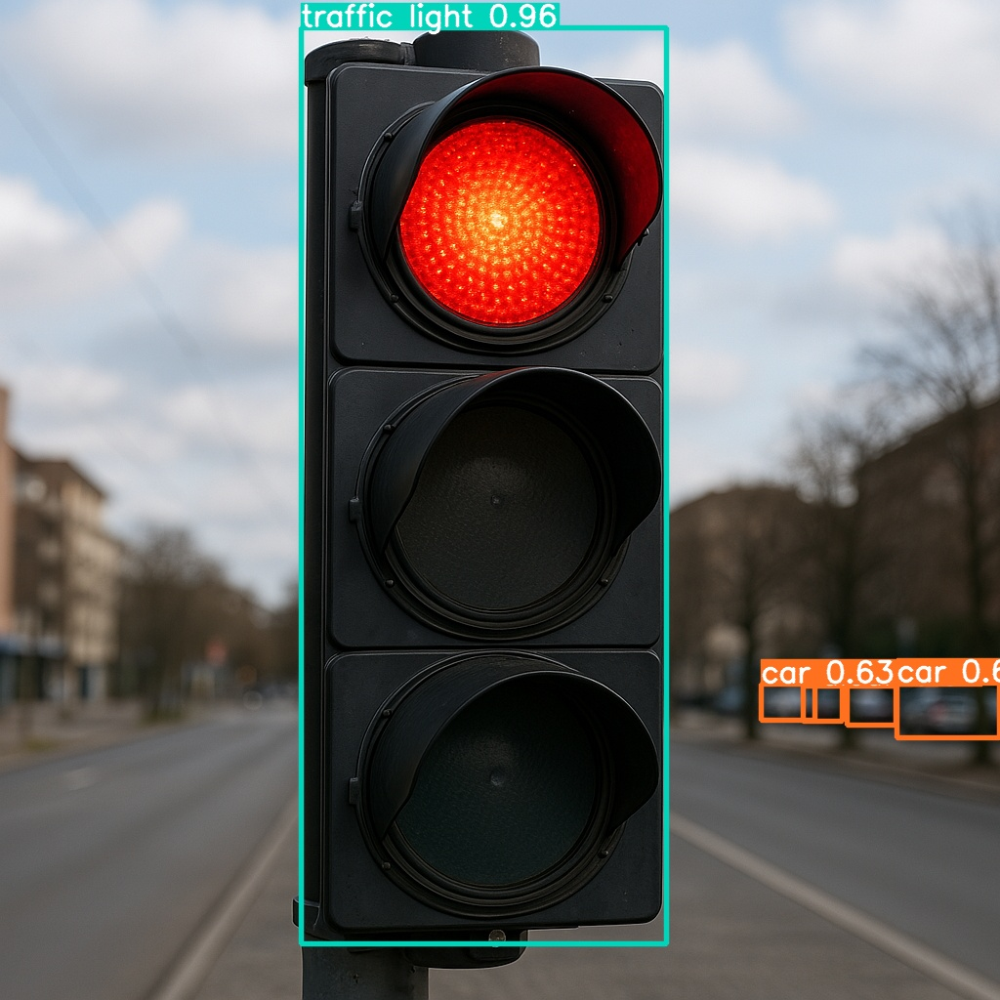

# [Startup_Demo](../../../)/[CV_VR](../../)/[AI_PC](../)/[DailyVision](./)

# DailyVision 🚦🧠

## 📚 Table of Contents
1. [Overview](#1-overview)
2. [Features](#2-features)
3. [Environment Setup](#3-Environment-Setup)
4. [Source Code Setup Instructions for Windows PC](#4-Source-Code-Setup-Instructions-for-Windows-PCs)
5. [Running DailyVision Application](#5-Running-DailyVision-Application)
6. [Application Output](#6-Application-Outputn)
7. [Conclusion](#7-Conclusion)

## 1. Overview

**DailyVision** is an Edge AI-powered assistive vision system designed to support users in a wide range of daily activities by recognizing visual cues in their environment, extracting relevant text, and providing real-time voice feedback. Whether navigating busy streets, identifying building entrances, reading public notices, or interpreting directional signs in unfamiliar areas, DailyVision acts as a smart visual assistant.

The system integrates advanced technologies such as Object detection, optical character recognition (OCR), and offline text-to-speech (TTS) to deliver fast assistance.


## 2. Features
- 🔍 **YOLOv8 Object Detection** for identifying objects.
- 🧾 **EasyOCR** for extracting text from detected regions  
- 🗣️ **Text-to-Speech** using `pyttsx3` for offline voice feedback  
- 🖼️ **Annotated image** output with bounding boxes and labels  

# 3. Environment Setup

🧪 To set up the Python environment required for running the application, follow the steps below. This ensures all dependencies are installed in an isolated and reproducible environment.

## 📦 3.1 Miniconda Installation

Miniconda is required to manage the application's Python environment and dependencies. Please follow the setup instructions carefully to ensure a consistent and reproducible environment.

For detailed steps, refer to the internal documentation:  
[Set up Miniconda]( ../../../Hardware/Tools.md#miniconda-setup)

## 🔧 3.2 Git Configuration

Git is required for version control and collaboration. Proper configuration ensures seamless integration with repositories and development workflows.

For detailed steps, refer to the internal documentation:  
[Setup Git]( ../../../Hardware/Tools.md#git-setup)

---

# 4. Source Code Setup Instructions for Windows PCs

The following steps are required to set up the source code for the application on Windows PCs.


## 🔧 Steps

1. **Create your working directory** :
   ```bash
   mkdir my_working_directory
   cd my_working_directory
   ```

2. **Download Your Application** :
   ```bash
    git clone -n --depth=1 --filter=tree:0 https://github.com/qualcomm/Startup-Demos.git
    cd Startup-Demos
    git sparse-checkout set --no-cone /CV_VR/AI_PC/DailyVision/
    git checkout
   ```
   
3. **Navigate to Application Directory** :
   ```bash
   cd ./CV_VR/AI_PC/DailyVision/src
   ```

4. **Create a new Conda environment** with Python 3.12:
   ```bash
   conda create -n myenv python=3.12
   ```

5. **Activate the environment**:
   ```bash
   conda activate myenv
   ```

6. **Install the required dependencies**:
   ```bash
   pip install -r requirements.txt
   ```

# 5. Running DailyVision Application

To run the DailyVision application, you will need to execute below commands in your terminal or command prompt. This section will guide you through the process of launching the application 

## Step 1: Navigate to the Application Directory
First, ensure that you are in the correct directory. You should be in the `src` folder of the DailyVision application. If you are not, navigate to the correct directory using the following command:

```bash
cd ./CV_VR/AI_PC/DailyVision/src
```
## Step 2: Run the Application
```bash
python vision_main.py
```

# 6. Application Output

The application will display the following output:

## Image Output
The application will display the input image with bounding boxes and labels for detected objects.



## Console Output
The application will display the output: "Detected a traffic light: with color: red"

## Text-to-Speech Output

The application will provide voice feedback for detected objects using text-to-speech.

# 7. Conclusion

The DailyVision application is a powerful tool for object detection and text extraction. It leverages YOLOv8 for object detection, EasyOCR for text extraction, and pyttsx3 for text-to-speech feedback. The application provides a seamless user experience with real-time object detection and text extraction, making it an ideal solution for various applications.
